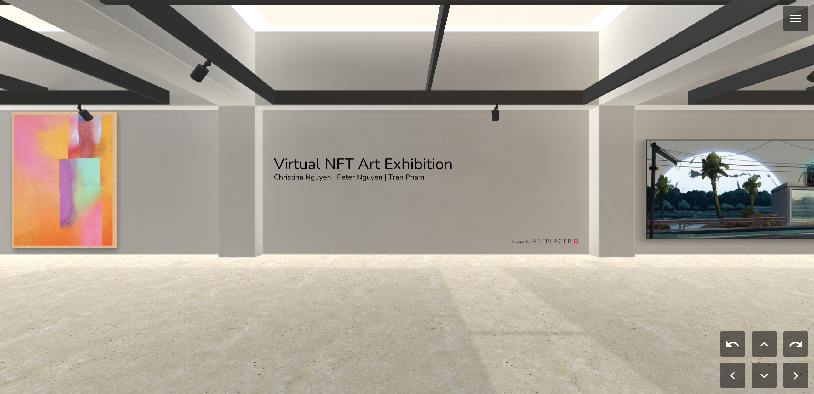

<!-- Improved compatibility of back to top link: See: https://github.com/othneildrew/Best-README-Template/pull/73 -->
<a name="readme-top"></a>
<!--
*** Thanks for checking out the Best-README-Template. If you have a suggestion
*** that would make this better, please fork the repo and create a pull request
*** or simply open an issue with the tag "enhancement".
*** Don't forget to give the project a star!
*** Thanks again! Now go create something AMAZING! :D
-->


<!-- PROJECT SHIELDS -->
<!--
*** I'm using markdown "reference style" links for readability.
*** Reference links are enclosed in brackets [ ] instead of parentheses ( ).
*** See the bottom of this document for the declaration of the reference variables
*** for contributors-url, forks-url, etc. This is an optional, concise syntax you may use.
*** https://www.markdownguide.org/basic-syntax/#reference-style-links
-->
[![Contributors][contributors-shield]][contributors-url]
[![Forks][forks-shield]][forks-url]
[![Stargazers][stars-shield]][stars-url]
[![Issues][issues-shield]][issues-url]
[![MIT License][license-shield]][license-url]


<!-- PROJECT LOGO -->
<br />
<div align="center">
  <a href="https://github.com/christina8711/crypto_gallery">
    
  </a>

<h3 align="center">Crypto Gallery</h3>

  <p align="center">
Interactive and educational NFT art exhibition website for artists and art lovers to enjoy art in a public VR space
    <br />
    <a href="https://github.com/christina8711/crypto_gallery"><strong>Explore the docs »</strong></a>
    <br />
    <br />
    <a href="https://github.com/christina8711/crypto_gallery">View Demo</a>
    ·
    <a href="https://github.com/christina8711/crypto_gallery/issues">Report Bug</a>
    ·
    <a href="https://github.com/christina8711/crypto_gallery/issues">Request Feature</a>
  </p>
</div>


<!-- TABLE OF CONTENTS -->
<details>
  <summary>Table of Contents</summary>
  <ol>
    <li>
      <a href="#about-the-project">About The Project</a>
      <ul>
         <li><a href="#prototype-demo">Prototype Demo</a></li>
        <li><a href="#disclaimer">Disclaimer</a></li>
      </ul>
    </li>
    <li>
      <a href="#getting-started">Getting Started</a>
      <ul>
        <li><a href="#installation">Installation</a></li>
      </ul>
    </li>
    <li><a href="#roadmap">Roadmap</a></li>
    <li><a href="#contributing">Contributing</a></li>
    <li><a href="#license">License</a></li>
    <li><a href="#contact">Contact</a></li>
    <li><a href="#acknowledgments">Acknowledgments</a></li>
  </ol>
</details>


<!-- ABOUT THE PROJECT -->
## About The Project

[![Product Name Screen Shot][product-screenshot]](https://www.figma.com/proto/0GpjNvYnQ2UOFGzLp2EGzn/Virtual-NFT-Art-Exhibition-Website?type=design&node-id=24-510&t=iFTDOoxP4ii7dCeN-1&scaling=scale-down-width&page-id=0%3A1&starting-point-node-id=34%3A48&mode=design)

## Project Overview

At Shellhacks 2023, we're tackling the challenges posed by Google and Microsoft by creating a website that doubles as an educational platform for NFTs. Our platform also offers a virtual art exhibition where users can explore NFT art, dive into the world of featured crypto artists, and gain insights into the showcased artworks. Augmented Reality is incorporated for users with a mobile device, allowing them to visualize NFT art in their own space.

## Prototype Development

To bring our project to life, we leveraged the capabilities of ['Art Placer'][art-placer], an art market platform renowned for its interactive virtual spaces. With ['Art Placer'][art-placer], we seamlessly constructed the immersive virtual environment that forms the backbone of our concept. This virtual space enables users to explore our NFT art exhibition with remarkable interactivity.

Within our ['Art Placer'][art-placer] virtual space, users can embark on a virtual tour, navigating through the NFT art exhibition. They can click on individual artworks to access a wealth of information, including essential details such as the Title, Artist, Gallery Price (in Ethereum), Date of creation, Medium (such as digital), and a comprehensive Art Description. We've also integrated links related to the artist, directing users to their NFT page and portfolio page for deeper engagement. For those interested in acquiring the artwork, a convenient 'Buy' button redirects users to the Opensea page, where they can make the purchase.

This dynamic virtual space, created in ['Art Placer'][art-placer], has been seamlessly embedded into our prototype website on Figma. Through this integration, we offer a glimpse into our project's true vision, demonstrating the convergence of art, education, and technology that lies at its core. Our prototype reflects the culmination of our efforts to provide users with a holistic NFT art experience that transcends traditional boundaries.

[art-placer]: https://www.artplacer.com/tools-for-artists-and-galleries/?gclid=CjwKCAjwpJWoBhA8EiwAHZFzfss-aNH2F_R07Lar48N52Jc5eiIZMVAs3EIpFIiXBotwrv-vdHZUzhoCgw8QAvD_BwE
<p align="right">(<a href="#readme-top">back to top</a>)</p>

## Prototype Demo
**Try Out Our Prototype:**

['Crypto Gallery Prototype'][Crypto_Gallery_P]

[Crypto_Gallery_P]:https://www.figma.com/proto/0GpjNvYnQ2UOFGzLp2EGzn/Virtual-NFT-Art-Exhibition-Website?type=design&node-id=24-510&t=iFTDOoxP4ii7dCeN-1&scaling=scale-down-width&page-id=0%3A1&starting-point-node-id=34%3A48&mode=design

## Disclaimer

**Important**: This project is designed to educate users about the concept of NFTs (Non-Fungible Tokens) and features a virtual reality (VR) space showcasing NFT art from various artists. It's important to note the following:

1. **Ownership of NFT Art**: The NFT art featured in this project is the creative work of various artists, and we do not claim ownership of the art displayed. All featured artwork belongs to its respective creators.

2. **Artist Credits**: we've made every effort to provide proper credit to the artists whose work is showcased in this project. You will find artist credits within the VR space or accompanying information.

3. **Links to Art**: In an effort to support and promote the artists, we have included links to the respective artists' profiles on [OpenSea](https://opensea.io/), a popular NFT marketplace, where you may have the opportunity to purchase their art.

4. **No Endorsement**: The inclusion of any artist's work or links to OpenSea does not imply endorsement or partnership with this project. The featured artists are not affiliated with this project unless otherwise stated.

5. **Legal Considerations**: If you are an artist or copyright holder and have concerns about the use of your work in this project, please contact me immediately. we are committed to addressing any legitimate concerns and respecting intellectual property rights.

6. **Educational Purpose**: This project primarily serves an educational purpose to help users learn about NFTs and appreciate the creativity of NFT artists. It is not intended for commercial use or profit.

Please understand that while we've taken precautions to respect the rights of artists, errors or omissions may occur. If you notice any issues or have concerns, please reach out, and we will promptly address them. Your feedback is valuable in ensuring the responsible and ethical use of NFT art within this project.

<p align="right">(<a href="#readme-top">back to top</a>)</p>

<!-- GETTING STARTED -->

### Getting Started

* npm
  ```sh
  npm install npm@latest -g
  ```

### Installation

1. **Clone the repo:**
   ```sh
   git clone https://github.com/christina8711/crypto_gallery.git
   ```
   - This step clones the repository from GitHub to your local machine.

2. **Navigate to the project directory:**
   ```sh
   cd crypto_gallery
   ```
   - Change your working directory to the newly cloned repository.

3. **Install Node.js and npm (if not already installed):**
   - Ensure that Node.js and npm are installed on your system. You can download them from the [official Node.js website](https://nodejs.org/).

4. **Install project-specific dependencies:**
   ```sh
   npm install
   ```
   - Use this command to install the project-specific Node.js packages and dependencies listed in the `package.json` file.


<p align="right">(<a href="#readme-top">back to top</a>)</p>


<!-- ROADMAP -->
## Roadmap

- [ ] Create a publicly accessible virtual reality (VR) platform that seamlessly integrates with opensea.com
- [ ] Create an interactive prototype that visually demonstrates our vision for the educational NFT art exhibition website
- [ ] Establish a GitHub repository with react setup
    - [ ] Code the frontend of the website
    - [ ] Code the backend of the website

See the [open issues](https://github.com/christina8711/crypto_gallery/issues) for a full list of proposed features (and known issues).

<p align="right">(<a href="#readme-top">back to top</a>)</p>


<!-- CONTRIBUTING -->
## Contributing

Contributions are what makes the open source community such an amazing place to learn, inspire, and create. Any contributions you make are **greatly appreciated**.

If you have a suggestion that would make this better, please fork the repo and create a pull request. You can also simply open an issue with the tag "enhancement".
Don't forget to give the project a star! Thanks again!

1. Fork the Project
2. Create your Feature Branch (`git checkout -b feature/AmazingFeature`)
3. Commit your Changes (`git commit -m 'Add some AmazingFeature'`)
4. Push to the Branch (`git push origin feature/AmazingFeature`)
5. Open a Pull Request

<p align="right">(<a href="#readme-top">back to top</a>)</p>


<!-- LICENSE -->
## License

Distributed under the MIT License. See `LICENSE.txt` for more information.

<p align="right">(<a href="#readme-top">back to top</a>)</p>


<!-- CONTACT -->
## Contact

Christina Nguyen - [![LinkedIn][linkedin-shield]][1linkedin-url] - ch487674@ucf.edu

Peter Nguyen - [![LinkedIn][linkedin-shield]][2linkedin-url] - pe264311@ucf.edu

Tran Pham - [![LinkedIn][linkedin-shield]][3linkedin-url] - Tran.pham2@ucf.edu

Project Link: [https://github.com/github_username/repo_name](https://github.com/christina8711/crypto_gallery)

<p align="right">(<a href="#readme-top">back to top</a>)</p>


<!-- ACKNOWLEDGMENTS -->
## Acknowledgments

We would like to extend our gratitude to the following:

- **Florida International University (FIU) and INIT:** We appreciate FIU and INIT for hosting ShellHacks Hackathon, which provided us with an incredible opportunity this weekend.

- **Our Dedicated Team:** A big shoutout to our hardworking team for putting in tireless efforts all weekend to achieve our goals.

- **Figma and Art Placer:** We want to acknowledge the invaluable role that Figma and Art Placer played in the development of our prototype, enabling us to bring our vision to life.

- **OpenSea:** Special thanks to OpenSea for offering an exceptional learning section. It allowed us to reference and gain a deeper understanding of NFTs, contributing significantly to our project's success.


<p align="right">(<a href="#readme-top">back to top</a>)</p>


<!-- MARKDOWN LINKS & IMAGES -->
<!-- https://www.markdownguide.org/basic-syntax/#reference-style-links -->
[contributors-shield]: https://img.shields.io/github/contributors/christina8711/Crypto_Gallery.svg?style=for-the-badge
[contributors-url]: https://github.com/christina8711/Crypto_Gallery/graphs/contributors
[forks-shield]: https://img.shields.io/github/forks/christina8711/Crypto_Gallery.svg?style=for-the-badge
[forks-url]: https://github.com/christina8711/Crypto_Gallery/network/members
[stars-shield]: https://img.shields.io/github/stars/christina8711/Crypto_Gallery.svg?style=for-the-badge
[stars-url]: https://github.com/christina8711/Crypto_Gallery/stargazers
[issues-shield]: https://img.shields.io/github/issues/christina8711/Crypto_Gallery.svg?style=for-the-badge
[issues-url]: https://github.com/christina8711/Crypto_Gallery/issues
[license-shield]: https://img.shields.io/github/license/christina8711/Crypto_Gallery.svg?style=for-the-badge
[license-url]: https://github.com/christina8711/Crypto_Gallery/blob/master/LICENSE.txt
[product-screenshot]: images/WebSS.png
[linkedin-shield]:https://img.shields.io/badge/Linkedin-blue?style=flat&logo=linkedin&ilabelColor=blue
[1linkedin-url]: https://www.linkedin.com/in/christinanguyen8711/
[2linkedin-url]: https://www.linkedin.com/in/peterh-nguyen/
[3linkedin-url]: https://www.linkedin.com/in/tranpham9/
